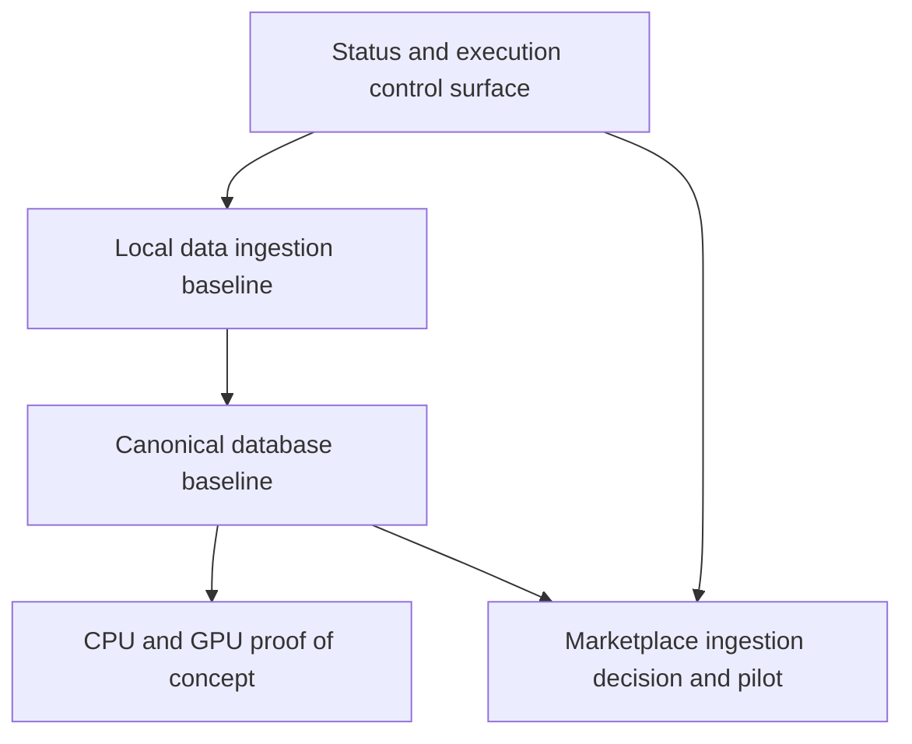

# ROADMAP.md

## Milestones

### M1. Status and execution control surface

- Add root-level status files
- Align agent loading order
- Establish handoff protocol

### M2. Local data ingestion baseline

- Copy local Space datasets into `data/raw/`
- Add example payloads for current schemas
- Create parser stubs for CSV and XLSX imports

### M3. Canonical database baseline

- Draft SQL DDL for entities, facts, relationships, offers, and listings
- Add compatibility-edge and price-offer schemas
- Define lifecycle and repairability field sets

### M4. CPU and GPU proof of concept

- Normalize local benchmark datasets
- Produce first canonical CPU and GPU entities
- Generate first value-oriented rankings

### M5. Marketplace ingestion decision and pilot

- Decide Trade Me and AU ingestion mode
- Implement first price-ingestion pilot
- Add landed-cost normalization rules

## Dependency DAG

## Near-term sequencing

1. M1 is complete
2. Start M2 on resume
3. Parallelize M3 design work with M2 imports when practical
4. Use M4 as the first end-to-end validation target
5. Treat M5 as a controlled pilot, not a fully scaled ingestion commitment
